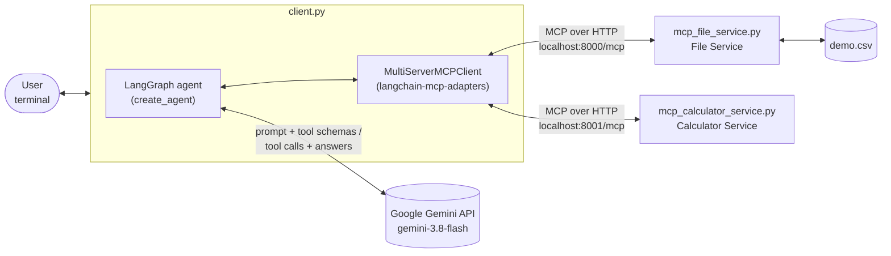
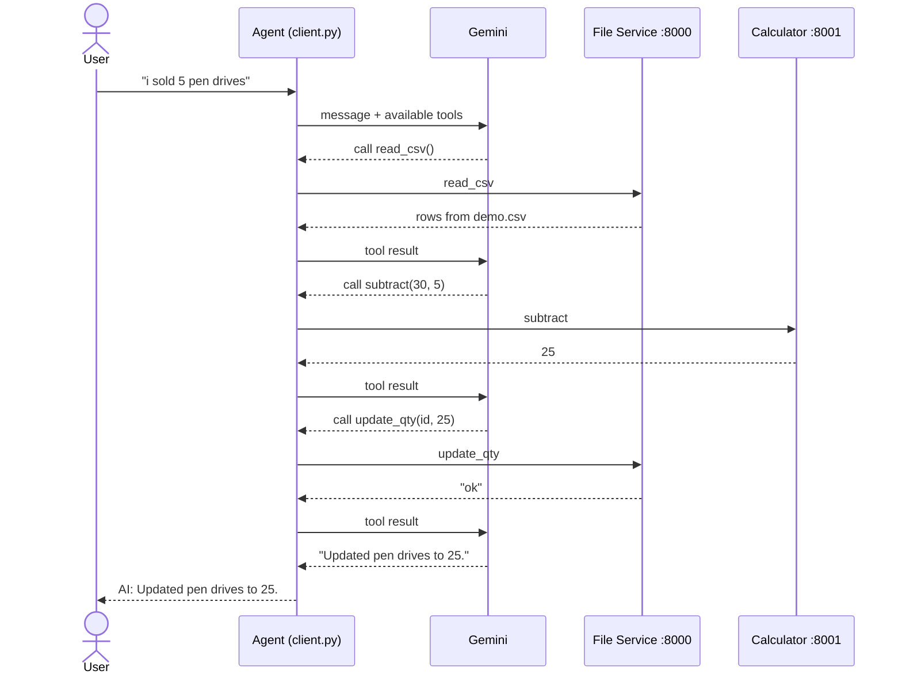

# Simple MCP Server

A small demo of the **Model Context Protocol (MCP)**. It runs two MCP tool servers (a CSV inventory service and a calculator) and a chat client in which a **Gemini**-powered **LangChain/LangGraph agent** uses those tools to answer questions in plain English.

```
You: i want to add 40 hard drives
AI: 40 hard drives have been added to the inventory.
```

## Architecture



| Component | File | Role |
|---|---|---|
| **File Service** | `mcp_file_service.py` | MCP server on port **8000**. Provides create, read, update and delete (CRUD) tools for the inventory in `demo.csv`. |
| **Calculator Service** | `mcp_calculator_service.py` | MCP server on port **8001**. Provides arithmetic tools. |
| **Client** | `client.py` | Connects to both servers, turns their tools into LangChain tools, and runs a chat loop with a Gemini agent. |
| **Data** | `demo.csv` | Inventory store with the columns `id`, `name` and `qty`. |

### How a request flows

The agent built by `create_agent` is a LangGraph graph with two nodes. The **model** node asks Gemini what to do next. The **tools** node runs the tool calls Gemini asks for through MCP. The agent loops between the two until Gemini replies without calling a tool.



Each step in which the agent asks Gemini counts as one API request, so a single chat message can use several requests.

## Available tools

**File Service** (`demo.csv`)

| Tool | Arguments | Description |
|---|---|---|
| `read_csv` | – | Returns all rows. |
| `add_row` | `name: str`, `qty: int` | Adds a row with a random 6-character ID. |
| `update_qty` | `row_id: str`, `qty: int` | Sets the quantity of a row. |
| `delete_row` | `row_id: str` | Deletes a row. |

The file service creates `demo.csv` with a header row if the file doesn't exist.

**Calculator Service**

| Tool | Arguments | Description |
|---|---|---|
| `subtract` | `a: int`, `b: int` | `a - b` |
| `divide` | `a: float`, `b: float` | `a / b` |
| `power` | `a: float`, `b: float` | `a ** b` |
| `mod` | `a: int`, `b: int` | `a % b` |

## Tech stack

- **Python** 3.10 or newer, managed with [uv](https://docs.astral.sh/uv/)
- **MCP servers:** `FastMCP` from the MCP Python SDK, using the streamable HTTP transport
- **Agent:** LangChain `create_agent`, which runs as a LangGraph graph
- **MCP to LangChain bridge:** `langchain-mcp-adapters`
- **LLM:** Google Gemini, through `langchain-google-genai`
- **Config:** `python-dotenv`

## Getting started

### 1. Install dependencies

```bash
uv sync
```

### 2. Configure your API key

```bash
cp .env.example .env
```

Open `.env` and add your Gemini API key, which you can get from [Google AI Studio](https://aistudio.google.com/apikey):

```
GEMINI_API_KEY=your-gemini-api-key-here
```

### 3. Start the MCP servers

Start each server in its own terminal:

```bash
uv run python mcp_file_service.py        # http://localhost:8000/mcp
```

```bash
uv run python mcp_calculator_service.py  # http://localhost:8001/mcp
```

### 4. Start the chat client

In a third terminal:

```bash
uv run python client.py
```

Both servers must be running before you start the client, because it loads their tools at startup.

## Example prompts

- `show me the inventory`
- `add 40 hard drives`
- `i sold 5 keyboards`
- `delete the pen drive row`
- `what is 2 to the power of 10?`

## Project structure

```
simple-mcp-server/
├── client.py                  # Gemini agent + chat loop
├── mcp_file_service.py        # MCP server: CSV inventory tools (port 8000)
├── mcp_calculator_service.py  # MCP server: math tools (port 8001)
├── demo.csv                   # Inventory data
├── pyproject.toml             # Project metadata & dependencies
├── uv.lock                    # Locked dependency versions
├── .env.example               # Environment variable template
└── .gitignore
```

## Known limitations

- **No conversation memory.** Each message is sent to the agent on its own, so follow-up questions like "make it 10 instead" won't work. You could add memory with a LangGraph checkpointer such as `InMemorySaver`, used with a `thread_id`.
- **Errors stop the client.** Any API error, such as a 429 quota error, ends the chat loop.
- **Gemini free-tier limits.** Each model has a small daily request quota on the free tier, and one chat message can use several requests.
- **No live data.** The agent can only use the tools listed above. For questions like exchange rates, it answers from the model's training data, which may be out of date.
- **Local only.** The servers have no authentication and are meant for local development.
